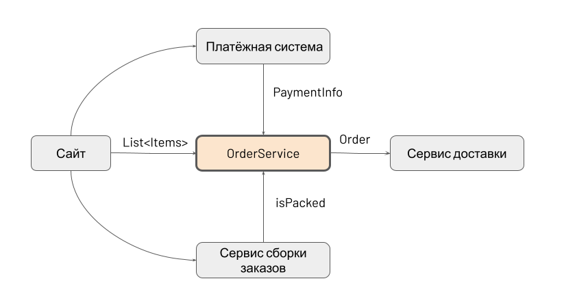

Вы работаете над системой для интернет-магазина. Заказы поступают через сайт, оплачиваются через платёжный шлюз и собираются на складе. Всё это разные сервисы.

Cервис OrderService принимает новые заказы, информацию об оплате и готовности заказа. Когда все части на месте, передаёт заказ сервису доставки:

Доставка должна произойти один раз!

.Задание:

 Сделать рефакторинг классов Order и OrderService с использованием неизменяемых переменных. Можете делать любые изменения кроме cигнатуры методов createOrder, updatePaymentInfo, setPacked и deliver. Основная задача - снизить количество синхронизации до минимума.

К сожалению, на этом учебном примере сложно понять преимущества функционального подхода. Здесь хорошей производительности можно достичь и с помощью изменяемых переменных. Так что просто потренируемся писать код чуть по-другому:)